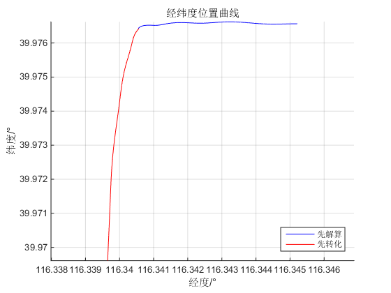
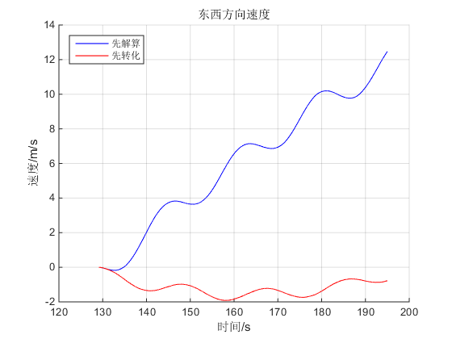
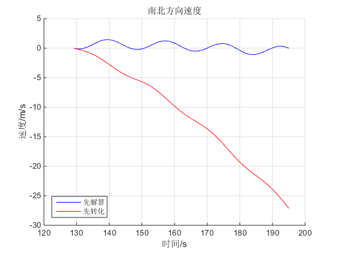
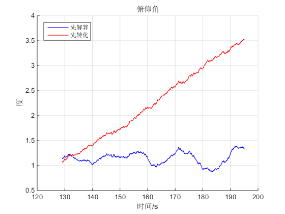
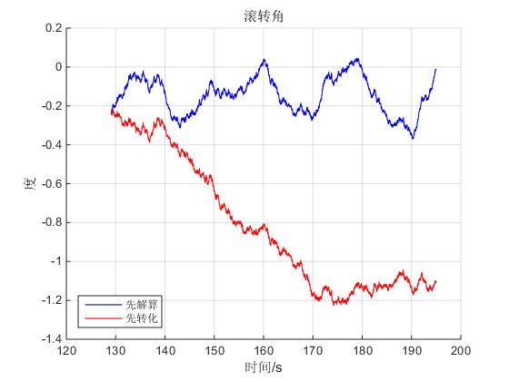
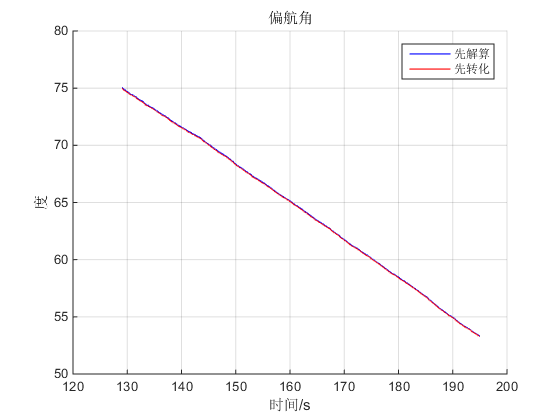

<div class="content">

Contents
--------

<div>

-   [读取数据并储存](#2)
-   [动态部分初值设定](#3)
-   [循环计算导航参数并更新状态（先解算再转化）](#4)
-   [先转化再解算](#5)
-   [统一绘图](#6)

</div>

``` matlab
% 旋转调制实验
% 采用方法：先转化到基座系，后解算导航参数。只对动态部分进行解算，与之前的结果作比较
clc;clear;
```

读取数据并储存[]()
------------------

``` matlab
data  = load('5第六组实验数据.mat');
lengthTotalData = 97500;
lengthStill = 64550;
lengthDynamic = lengthTotalData - lengthStill;
fibbx(1,:)=data.temp_data(:,1)*9.80;                                       %x方向的比力数据
fibby(1,:)=data.temp_data(:,2)*9.80;                                       %y方向的比力数据
fibbz(1,:)=data.temp_data(:,3)*9.80;                                       %z方向的比力数据
Wibx(1,:)=data.temp_data(:,4)*pi/180;                                      %提取陀螺正东方向角速率并定义
Wiby(1,:)=data.temp_data(:,5)*pi/180;                                      %提取陀螺正北方向角速率并定义
Wibz(1,:)=data.temp_data(:,6)*pi/180;                                      %提取陀螺天向角速率并定义

L(1,:)=zeros(1,lengthTotalData);
Lambda(1,:)=zeros(1,lengthTotalData);
Vx(1,:)=zeros(1,lengthTotalData);
Vy(1,:)=zeros(1,lengthTotalData);
Vz(1,:)=zeros(1,lengthTotalData);
Rx(1,:)=zeros(1,lengthTotalData);                                          %定义存放卯酉圈曲率半径数据的矩阵
Ry(1,:)=zeros(1,lengthTotalData);                                          %定义存放子午圈曲率半径数据的矩阵
psi(1,:)=zeros(1,lengthTotalData);                                         %定义存放偏航角数据的矩阵
theta(1,:)=zeros(1,lengthTotalData);                                       %定义存放俯仰角数据的矩阵
gamma(1,:)=zeros(1,lengthTotalData);                                       %定义存放滚转角数据的矩阵
I=eye(4);                                                                  %定义四阶矩阵用于计算四元数

%其他相关常量
g0=9.7803267714;
gk1=0.00193185138639;
gk2=0.00669437999013;
Wie=7.292115147e-5;                                                        %地球自转角速度
Re=6378245;                                                                %长半径
e=1/298.3;                                                                 %椭圆度
t=1/500;                                                                   %采样周期

%定义初始状态
L(1,1)=39.976419/180*pi;                                                   %纬度初始值 单位：弧度
Lambda(1,1)=116.340561/180*pi;                                             %经度初始值 单位：弧度
H=57;                                                                      %高度
Vx(1,1)=0;                                                                 %初始速度x方向分量
Vy(1,1)=0;                                                                 %初始速度y方向分量
Vz(1,1)=0;                                                                 %初始速度z方向分量
psi(1,1)=2*pi-75 /180*pi;                                                  %偏航角初始值 单位：弧度
theta(1,1)=0;                                                              %俯仰角初始值（待计算） 单位：弧度
gamma(1,1)=0;                                                              %滚转角初始值（待计算） 单位：弧度
```

动态部分初值设定[]()
--------------------

``` matlab
ave_S_fibbx = mean(fibbx(1,1:60000));
ave_S_fibby = mean(fibby(1,1:60000));
ave_S_fibbz = mean(fibbz(1,1:60000));
theta(1,1) = asin(ave_S_fibby/ave_S_fibbz);                                %俯仰角初值（近似求解）
gamma(1,1) = asin(ave_S_fibbx/ave_S_fibbz);                                %滚转角初值（近似求解）
L(1,lengthStill+1)=39.976419/180*pi;                                       %纬度初始值 单位：弧度
Lambda(1,lengthStill+1)=116.340561/180*pi;                                 %经度初始值 单位：弧度
H=57;                                                                      %高度
Vx(1,lengthStill+1)=0;                                                     %初始速度x方向分量
Vy(1,lengthStill+1)=0;                                                     %初始速度y方向分量
Vz(1,lengthStill+1)=0;                                                     %初始速度z方向分量
theta(1,lengthStill+1) = theta(1,1);
gamma(1,lengthStill+1) = gamma(1,1);
psi(1,lengthStill+1)=2*pi-75 /180*pi;                                      %偏航角初始值 单位：弧度

%求解四元数系数q0,q1,q2,q3的初值
q(1,lengthStill+1)=cos(psi(1,1)/2)*cos(theta(1,1)/2)*cos(gamma(1,1)/2)...
      +sin(psi(1,1)/2)*sin(theta(1,1)/2)*sin(gamma(1,1)/2);                %q0
q(2,lengthStill+1)=cos(psi(1,1)/2)*sin(theta(1,1)/2)*cos(gamma(1,1)/2)...
      +sin(psi(1,1)/2)*cos(theta(1,1)/2)*sin(gamma(1,1)/2);                %q1
q(3,lengthStill+1)=cos(psi(1,1)/2)*cos(theta(1,1)/2)*sin(gamma(1,1)/2)...
      -sin(psi(1,1)/2)*sin(theta(1,1)/2)*cos(gamma(1,1)/2);                %q2
q(4,lengthStill+1)=cos(psi(1,1)/2)*sin(theta(1,1)/2)*sin(gamma(1,1)/2)...
      -sin(psi(1,1)/2)*cos(theta(1,1)/2)*cos(gamma(1,1)/2);                %q3
```

循环计算导航参数并更新状态（先解算再转化）[]()
----------------------------------------------

``` matlab
for i=lengthStill+1:lengthTotalData-1
    g=g0*(1+gk1*sin(L(i)^2)*(1-2*H/Re)/sqrt(1-gk2*sin(L(i)^2)));           %计算重力加速度
    Rx(i)=Re/(1-e*(sin(L(i)))^2);                                          %根据纬度计算卯酉圈曲率半径
    Ry(i)=Re/(1+2*e-3*e*(sin(L(i)))^2);                                    %根据纬度计算子午圈曲率半径
    %求解四元数姿态矩阵
    q0=q(1,i);q1=q(2,i);q2=q(3,i);q3=q(4,i);
    Ctb=[q0^2+q1^2-q2^2-q3^2, 2*(q1*q2+q0*q3), 2*(q1*q3-q0*q2);
        2*(q1*q2-q0*q3),q2^2-q3^2+q0^2-q1^2,2*(q2*q3+q0*q1);
        2*(q1*q3+q0*q2),2*(q2*q3-q0*q1),q3^2-q2^2-q1^2+q0^2;];
    Cbt=Ctb';
    fibt=Cbt*[fibbx(i);fibby(i);fibbz(i)];                                 %比力数据
    fibtx(i)=fibt(1,1);fibty(i)=fibt(2,1);fibtz(i)=fibt(3,1);
    Vx(1,i+1)=(fibtx(i)+(2*Wie*sin(L(i))+Vx(i)*tan(L(i))/Rx(i))*Vy(i)...
             -(2*Wie*cos(L(i))+Vx(i)/Rx(i))*Vz(i))*t+Vx(i);                %计算速度x方向分量
    Vy(1,i+1)=(fibty(i)-(2*Wie*sin(L(i))+Vx(i)*tan(L(i))/Rx(i))*Vx(i)...
             +Vy(i)*Vz(i)/Ry(i))*t+Vy(i);                                  %计算速度y方向分量
    Vz(1,i+1)=(fibtz(i)+(2*Wie*cos(L(i)+Vx(i))/Rx(i))*Vx(i)...
             +Vy(i)*Vy(i)/Ry(i)-g)*t+Vz(i);                                %计算速度z方向分量
    Witt=[-Vy(i)/Ry(i);
        Wie*cos(L(i))+Vx(i)/Rx(i);
        Wie*sin(L(i))+Vx(i)*tan(L(i))/Rx(i)];                              %求出平台指令角速度值
    Wibb=[Wibx(i);Wiby(i);Wibz(i)];
    Wtbb=Wibb-Ctb*Witt;                                                    %将指令角速度转换到平台坐标系,并求解Wtbb
    L(1,i+1)=t*Vy(i)/Ry(i)+L(i);
    Lambda(1,i+1)=t*Vx(i)/(Rx(i)*cos(L(i)))+ Lambda(i);
    x=Wtbb(1,1)*t;y=Wtbb(2,1)*t;z=Wtbb(3,1)*t;                             %求取迭代矩阵中的各Δtheta
    A=[0 -x -y -z;x 0 z -y;y -z 0 x;z y -x 0];                             %求取迭代矩阵[Δtheta]
    T=x^2+y^2+z^2;                                                         %计算[Δtheta]^2的
    q(:,i+1)=((1-T/8+T^2/384)*I+(1/2-T/48)*A)*q(:,i);                      %求q
    theta(i+1)=asin(Ctb(2,3));
    %主值判断
    if(Ctb(2,2)>0)
        if(Ctb(2,1)>=0)
            psi(i+1)=2*pi-(atan(Ctb(2,1)/Ctb(2,2)));
        else
            psi(i+1)=2*pi-(atan(Ctb(2,1)/Ctb(2,2))+2*pi);
        end
    elseif(Ctb(2,2)<0)
        if(Ctb(2,1)>0)
            psi(i+1)=2*pi-(atan(Ctb(2,1)/Ctb(2,2))+pi);
        else
            psi(i+1)=2*pi-(atan(Ctb(2,1)/Ctb(2,2))+pi);
        end
    end
    if(Ctb(3,3)>0)
        gamma(i+1)=atan(-Ctb(1,3)/Ctb(3,3));
    elseif(Ctb(1,3)<0)
        gamma(i+1)=atan(-Ctb(1,3)/Ctb(3,3))+pi;
    else
        gamma(i+1)=atan(-Ctb(1,3)/Ctb(3,3))-pi;
    end
end
psi(1,1) = 75 /180*pi;
psi(1,lengthStill+1)=75 /180*pi;

%平台系到基座系
base_Vx(1,:)=zeros(1,lengthTotalData);
base_Vy(1,:)=zeros(1,lengthTotalData);
base_Vz(1,:)=zeros(1,lengthTotalData);
base_theta(1,:)=zeros(1,lengthTotalData);                                  %定义存放俯仰角数据的矩阵
base_gamma(1,:)=zeros(1,lengthTotalData);                                  %定义存放滚转角数据的矩阵
base_psi(1,:)=zeros(1,lengthTotalData);                                    %定义存放偏航角数据的矩阵
tempAngle = 0;

for i=lengthStill+1:lengthTotalData
    tempAngle = tempAngle + 20 * 1 / 500;
    tempAngle = mod(tempAngle,360);
    angle = tempAngle * pi / 180;
    base_psi(i) = psi(i) + angle;
    if base_psi(i)>2*pi
        base_psi(i) = base_psi(i) - 2*pi;
    end
    base_theta(1,i) = theta(1,1)+theta(1,i) - theta(1,83000) * sin(angle+75*pi/180);
    base_gamma(1,i) = gamma(1,1)+gamma(1,i) + gamma(1,83000+90/20*500) * cos(angle+75*pi/180);
end
```

先转化再解算[]()
----------------

``` matlab
base_fibbx(1,:)=fibbx(1:lengthTotalData);                                  %x方向的比力数据
base_fibby(1,:)=fibby(1:lengthTotalData);                                  %y方向的比力数据
base_fibbz(1,:)=fibbz(1:lengthTotalData);                                  %z方向的比力数据
base_Wibx(1,:)=Wibx(1:lengthTotalData);                                    %提取陀螺正东方向角速率并定义
base_Wiby(1,:)=Wiby(1:lengthTotalData);                                    %提取陀螺正北方向角速率并定义
base_Wibz(1,:)=Wibz(1:lengthTotalData) + 20*pi/180;
NL(1,:)=zeros(1,lengthTotalData);
NLambda(1,:)=zeros(1,lengthTotalData);
NVx(1,:)=zeros(1,lengthTotalData);
NVy(1,:)=zeros(1,lengthTotalData);
NVz(1,:)=zeros(1,lengthTotalData);
Npsi(1,:)=zeros(1,lengthTotalData);                                        %定义存放偏航角数据的矩阵
Ntheta(1,:)=zeros(1,lengthTotalData);                                      %定义存放俯仰角数据的矩阵
Ngamma(1,:)=zeros(1,lengthTotalData);                                      %定义存放滚转角数据的矩阵
%初值设定
Ntheta(1,lengthStill+1) = theta(1,1);
Ngamma(1,lengthStill+1) = gamma(1,1);
Npsi(1,lengthStill+1)=2*pi-75 /180*pi;                                     %偏航角初始值 单位：弧度
NL(1,lengthStill+1)=39.976419/180*pi;                                      %纬度初始值 单位：弧度
NLambda(1,lengthStill+1)=116.340561/180*pi;                                %经度初始值 单位：弧度
H=57;
%求解四元数系数q0,q1,q2,q3的初值
q(1,lengthStill+1)=cos(Npsi(1,lengthStill+1)/2)*cos(Ntheta(1,lengthStill+1)/2)*cos(Ngamma(1,lengthStill+1)/2)...
      +sin(Npsi(1,lengthStill+1)/2)*sin(Ntheta(1,lengthStill+1)/2)*sin(Ngamma(1,lengthStill+1)/2);                %q0
q(2,lengthStill+1)=cos(Npsi(1,lengthStill+1)/2)*sin(Ntheta(1,lengthStill+1)/2)*cos(Ngamma(1,lengthStill+1)/2)...
      +sin(Npsi(1,lengthStill+1)/2)*cos(Ntheta(1,lengthStill+1)/2)*sin(Ngamma(1,lengthStill+1)/2);                %q1
q(3,lengthStill+1)=cos(Npsi(1,lengthStill+1)/2)*cos(Ntheta(1,lengthStill+1)/2)*sin(Ngamma(1,lengthStill+1)/2)...
      -sin(Npsi(1,lengthStill+1)/2)*sin(Ntheta(1,lengthStill+1)/2)*cos(Ngamma(1,lengthStill+1)/2);                %q2
q(4,lengthStill+1)=cos(Npsi(1,lengthStill+1)/2)*sin(Ntheta(1,lengthStill+1)/2)*sin(Ngamma(1,lengthStill+1)/2)...
      -sin(Npsi(1,lengthStill+1)/2)*cos(Ntheta(1,lengthStill+1)/2)*cos(Ngamma(1,lengthStill+1)/2);                %q3
%循环计算导航参数并更新状态
for i=lengthStill+1:lengthTotalData-1
    g=g0*(1+gk1*sin(NL(i)^2)*(1-2*H/Re)/sqrt(1-gk2*sin(NL(i)^2)));         %计算重力加速度
    Rx(i)=Re/(1-e*(sin(NL(i)))^2);                                         %根据纬度计算卯酉圈曲率半径
    Ry(i)=Re/(1+2*e-3*e*(sin(NL(i)))^2);                                   %根据纬度计算子午圈曲率半径
    %求解四元数姿态矩阵
    q0=q(1,i);q1=q(2,i);q2=q(3,i);q3=q(4,i);
    Ctb=[q0^2+q1^2-q2^2-q3^2, 2*(q1*q2+q0*q3), 2*(q1*q3-q0*q2);
        2*(q1*q2-q0*q3),q2^2-q3^2+q0^2-q1^2,2*(q2*q3+q0*q1);
        2*(q1*q3+q0*q2),2*(q2*q3-q0*q1),q3^2-q2^2-q1^2+q0^2;];
    Cbt=Ctb';
    fibt=Cbt*[base_fibbx(i);base_fibby(i);base_fibbz(i)];                  %比力数据
    fibtx(i)=fibt(1,1);fibty(i)=fibt(2,1);fibtz(i)=fibt(3,1);
    NVx(1,i+1)=(fibtx(i)+(2*Wie*sin(NL(i))+NVx(i)*tan(NL(i))/Rx(i))*NVy(i)...
             -(2*Wie*cos(NL(i))+NVx(i)/Rx(i))*NVz(i))*t+NVx(i);            %计算速度x方向分量
    NVy(1,i+1)=(fibty(i)-(2*Wie*sin(NL(i))+NVx(i)*tan(NL(i))/Rx(i))*NVx(i)...
             +NVy(i)*NVz(i)/Ry(i))*t+NVy(i);                               %计算速度y方向分量
    NVz(1,i+1)=(fibtz(i)+(2*Wie*cos(NL(i)+NVx(i))/Rx(i))*NVx(i)...
             +NVy(i)*NVy(i)/Ry(i)-g)*t+NVz(i);                             %计算速度z方向分量
    Witt=[-NVy(i)/Ry(i);
        Wie*cos(NL(i))+NVx(i)/Rx(i);
        Wie*sin(NL(i))+NVx(i)*tan(NL(i))/Rx(i)];                           %求出平台指令角速度值
    Wibb=[base_Wibx(i);base_Wiby(i);base_Wibz(i)];
    Wtbb=Wibb-Ctb*Witt;                                                    %将指令角速度转换到平台坐标系,并求解Wtbb
    NL(1,i+1)=t*NVy(i)/Ry(i)+NL(i);
    NLambda(1,i+1)=t*NVx(i)/(Rx(i)*cos(NL(i)))+ NLambda(i);
    x=Wtbb(1,1)*t;y=Wtbb(2,1)*t;z=Wtbb(3,1)*t;                             %求取迭代矩阵中的各Δtheta
    A=[0 -x -y -z;x 0 z -y;y -z 0 x;z y -x 0];                             %求取迭代矩阵[Δtheta]
    T=x^2+y^2+z^2;                                                         %计算[Δtheta]^2的
    q(:,i+1)=((1-T/8+T^2/384)*I+(1/2-T/48)*A)*q(:,i);                      %求q
    Ntheta(i+1)=asin(Ctb(2,3));
    %主值判断
    if(Ctb(2,2)>0)
        if(Ctb(2,1)>=0)
            Npsi(i+1)=2*pi-(atan(Ctb(2,1)/Ctb(2,2)));
        else
            Npsi(i+1)=2*pi-(atan(Ctb(2,1)/Ctb(2,2))+2*pi);
        end
    elseif(Ctb(2,2)<0)
        if(Ctb(2,1)>0)
            Npsi(i+1)=2*pi-(atan(Ctb(2,1)/Ctb(2,2))+pi);
        else
            Npsi(i+1)=2*pi-(atan(Ctb(2,1)/Ctb(2,2))+pi);
        end
    end
    if(Ctb(3,3)>0)
        Ngamma(i+1)=atan(-Ctb(1,3)/Ctb(3,3));
    elseif(Ctb(1,3)<0)
        Ngamma(i+1)=atan(-Ctb(1,3)/Ctb(3,3))+pi;
    else
        Ngamma(i+1)=atan(-Ctb(1,3)/Ctb(3,3))-pi;
    end
end
Npsi(1,lengthStill+1)=75 /180*pi;
```

统一绘图[]()
------------

``` matlab
ts=linspace(0,(lengthStill-1)/500,lengthStill);
td=linspace((lengthStill)/500,(lengthTotalData-1)/500,lengthDynamic);

figure, hold on;
plot(Lambda(lengthStill+1:lengthTotalData)*180/pi,L(lengthStill+1:lengthTotalData)*180/pi,'b');
plot(NLambda(lengthStill+1:lengthTotalData)*180/pi,NL(lengthStill+1:lengthTotalData)*180/pi,'r');
title('经纬度位置曲线'); xlabel('经度/°'); ylabel('纬度/°'); legend('先解算','先转化','Location','southeast');
grid on; axis equal; hold off;

figure, hold on;
plot(td,Vx(lengthStill+1:lengthTotalData),'b');
plot(td,NVx(lengthStill+1:lengthTotalData),'r');
title('东西方向速度');xlabel('时间/s');ylabel('速度/m/s');legend('先解算','先转化','Location','northwest');
grid on; hold off;

figure, hold on;
plot(td,Vy(lengthStill+1:lengthTotalData),'b');
plot(td,NVy(lengthStill+1:lengthTotalData),'r');
title('南北方向速度');xlabel('时间/s');ylabel('速度/m/s');legend('先解算','先转化','Location','southwest');
grid on; hold off;

figure, hold on;
plot(td,base_theta(lengthStill+1:lengthTotalData)*180/pi,'b');
plot(td,Ntheta(lengthStill+1:lengthTotalData)*180/pi,'r');
title('俯仰角');xlabel('时间/s');ylabel('度');legend('先解算','先转化','Location','northwest');
grid on; hold off;

figure, hold on;
plot(td,base_gamma(lengthStill+1:lengthTotalData)*180/pi,'b');
plot(td,Ngamma(lengthStill+1:lengthTotalData)*180/pi,'r');
title('滚转角');xlabel('时间/s');ylabel('度');legend('先解算','先转化','Location','southwest');
grid on; hold off;

figure, hold on;
plot(td,base_psi(lengthStill+1:lengthTotalData)*180/pi,'b');
plot(td,Npsi(lengthStill+1:lengthTotalData)*180/pi,'r');
title('偏航角');xlabel('时间/s');ylabel('度');legend('先解算','先转化','Location','northeast');
grid on; hold off;
```

  
  
\
[Published with MATLAB®
R2014b](http://www.mathworks.com/products/matlab/)\

</div>
